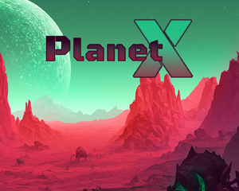

# PlanetX

A small but complete demo game for Torque2D 4.0, built the same way the
Project Manager scaffolds a real game project. It exists so you can read one
codebase that goes all the way: title screen, gameplay, win/lose dialogs,
level-to-level progression, and back to the title.



## Playing

Launch Torque2D and pick the **PlanetX** card in the Project Selector. Or boot
straight into it from `main.cs` (see the commented PlanetX block there).

Your rocket put you down on the wrong side of the planet. Somewhere out there
is the crystal you came for.

- **WASD / arrow keys** — move
- **Mouse** — aim; **hold left button** — fire
- **Escape** — abandon the mission and return to the title screen

Aliens nest in clusters across the surface and swarm you on sight; the big
dark-shelled brutes take four times the punishment. Contact hurts — your hull
bar is top-left. Your laser builds heat as you fire (the bar under the hull
bar); redline it and the gun vents steam and locks until it cools, so shoot
in bursts.

Touch the crystal to clear the level. Every level is generated fresh from a
new seed and each one is harder than the last: more aliens, more brutes, and
tougher, faster, harder-hitting versions of both. Dying restarts the current
level with a fresh layout.

## How it's put together

```
PlanetX/
├── AppCore/1/     project bootstrap (copied from library/AppCore, retinted
│                  to the Rocket Edition palette in gui/guiProfiles.cs)
├── Audio/1/       the standard Audio module (verbatim library copy)
├── ScreenFade/1/  canvas fade transitions (verbatim library copy)
└── PlanetXGame/   the game itself
    ├── game.cs            module lifecycle + the title/playing/won/lost state
    │                      machine, including level advancement
    ├── scripts/level.cs   scene, Perlin-tinted CompositeSprite terrain, seeded
    │                      random placement of the rocket and crystal
    ├── scripts/player.cs  the spaceman: a two-sprite composite (flipping body,
    │                      360-degree rotating gun), movement, health
    ├── scripts/input.cs   WASD ActionMap + mouse aim (window-point re-projection)
    ├── scripts/bullet.cs  pooled laser bolts, impact bursts, and gun heat
    ├── scripts/alien.cs   aliens + brutes, noise-driven nest spawning, and the
    │                      per-level difficulty curve (applyDifficulty)
    ├── scripts/crystal.cs the objective (a static sensor)
    ├── scripts/hud.cs     hull bar, heat bar, level label, objective hint
    ├── scripts/behaviors/ ChaseBehavior + TakesDamageBehavior (adapted from DeathBallToy)
    ├── gui/               title screen, victory + game-over dialogs (TAML)
    ├── particles/         the overheat steam vent (ParticleAsset)
    ├── sprites/           all game art, generated in the Rocket Edition palette
    └── music/, sound/     the planetfall track, laser and steam effects
```

Things worth stealing:

- **Project scaffold** — a top-level folder with its own AppCore is all it
  takes to appear in the Project Selector. Only the project folder is scanned
  at boot, so the project carries copies of every module and asset it uses.
- **Palette retint** — the six colors in `AppCore::SetProfileColors`
  (`AppCore/1/gui/guiProfiles.cs`) restyle every stock GUI profile at once.
- **Perlin terrain** — the ground is one rect-layout `CompositeSprite` of
  near-white tiles tinted per-corner (`setSpriteComplexColor`). Noise is
  sampled once per grid *vertex* and each tile reuses the vertices it shares
  with its neighbors, so the Gouraud interpolation is seamless across seams
  (`level.cs::buildTileMap`).
- **Noise is not an RNG** — one seed drives the whole level, but in two ways:
  the `NoiseGenerator` shapes *fields* (terrain colors, alien nests) while a
  reseeded `getRandom` picks *points* (rocket, crystal, brutes). Sampling
  Perlin noise at a fixed coordinate clusters around 0.5 across seeds, so it
  cannot substitute for a uniform random number (`level.cs::buildLevel`).
- **Composite characters** — the spaceman is two batch sprites on one body:
  the side-view body flips left/right while the gun sprite rotates to the
  true aim angle, so aim never lags movement (`player.cs`).
- **Angle convention** — `mAtan(Vector2Sub(target, origin))` and
  `setLinearVelocityPolar` both use 0° = +X, counter-clockwise. All PlanetX
  art is drawn facing +X, so no fudge offsets appear anywhere.
- **Pooled projectiles** — `bullet.cs` pre-builds its bolts and bursts
  (TruckToy's pattern) so firing never allocates mid-play. Note the
  `setFixedAngle(true)` on the bolts: collisions impart angular velocity that
  survives pooling, and without it recycled bullets come back spinning.
- **Behaviors** — the alien AI is two small `BehaviorTemplate`s composed onto
  a plain Sprite; `chaseBehavior.cs` shows the self-scheduled tick pattern
  with a game-state guard.
- **Difficulty in one place** — `alien.cs::applyDifficulty` maps the level
  number onto a handful of `$PlanetX::Cur*` globals that every spawn reads,
  so the whole curve is tunable from a single function.
- **Teardown** — `PlanetXGame::teardownLevel` deletes the scene + root GUI
  and rebuilds from scratch for every retry and level change; three loops in
  a row leak nothing (check `PlanetXScene.getCount()` stays constant).

All sprite art was generated for this demo in the Torque2D Rocket Edition
palette (#EA4848 / #A62646 / #801946 / #300022 / #21BF84) and is MIT-licensed
with the engine, like the rest of the project.
